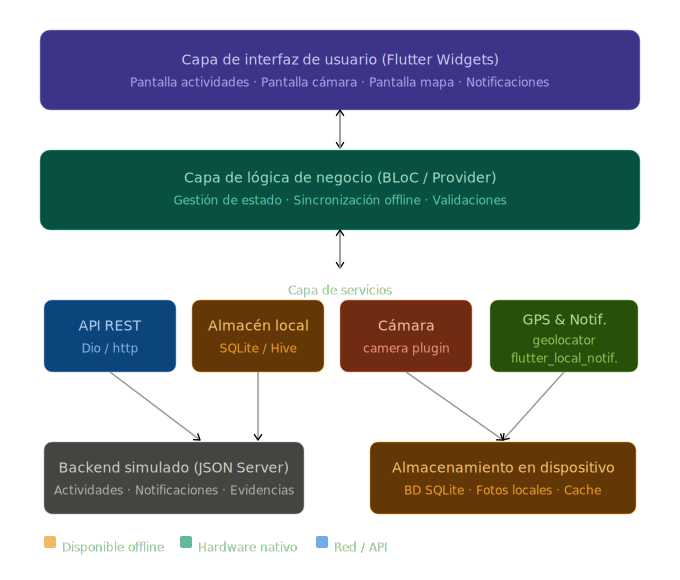

# unidad-3
# Diseño técnico de una aplicación móvil multiplataforma para un contexto educativo real

| Campo | Detalle |
|---|---|
| **Estudiante** | [Ana Sofia Vargas Gaviria] |
| **Asignatura** | Lenguaje de Computación para Móviles |
| **Unidad** | Unidad 3 – Desarrollo web multiplataforma orientado a dispositivos móviles |
| **Fecha** | 2026-05-25 |

---

## 1. Descripción del problema

### Contexto

Una institución educativa necesita una aplicación móvil para mejorar la comunicación académica con sus estudiantes. Actualmente, la información académica (actividades, fechas de entrega, notificaciones) se comparte por canales dispersos como grupos de WhatsApp, correo electrónico y tableros físicos, lo que genera pérdida de mensajes, falta de trazabilidad y problemas de acceso cuando los estudiantes no cuentan con conexión estable a internet.

### Público objetivo

Estudiantes de la institución educativa, en su mayoría con dispositivos Android de gama media o baja, con acceso intermitente a internet (datos móviles limitados o redes Wi-Fi inestables).

### Escenarios principales de uso

- Un estudiante consulta sus actividades académicas pendientes desde su casa sin conexión a internet.
- Un estudiante recibe una notificación de una nueva actividad publicada por el docente.
- Un estudiante captura una fotografía como evidencia de una tarea realizada y la sube al sistema cuando recupera la conexión.
- Un estudiante registra su ubicación junto con la evidencia fotográfica para validar que estuvo presente en un lugar específico.
- Un docente publica una nueva actividad en el sistema y todos los estudiantes la reciben como notificación.

---

## 2. Historias de usuario priorizadas

Las siguientes historias de usuario están ordenadas por prioridad (de mayor a menor):

| # | Historia de usuario | Prioridad |
|---|---|---|
| HU-01 | Como **estudiante**, quiero consultar mis actividades académicas pendientes, para organizar mejor mi tiempo y no perder entregas importantes. | Alta |
| HU-02 | Como **estudiante**, quiero poder ver mis actividades aunque no tenga conexión a internet, para acceder a la información en cualquier momento. | Alta |
| HU-03 | Como **estudiante**, quiero recibir notificaciones cuando se publique una nueva actividad, para estar siempre informado sin tener que abrir la aplicación constantemente. | Alta |
| HU-04 | Como **estudiante**, quiero capturar una fotografía desde la app como evidencia de una actividad realizada, para enviar el registro visual directamente al sistema. | Media |
| HU-05 | Como **estudiante**, quiero que mi ubicación quede registrada junto con la evidencia fotográfica, para demostrar que estuve en el lugar donde realicé la actividad. | Media |
| HU-06 | Como **estudiante**, quiero que la aplicación funcione bien en mi celular de gama media, para no tener problemas de lentitud o cierres inesperados. | Media |
| HU-07 | Como **estudiante**, quiero sincronizar automáticamente mi evidencia cuando recupere la conexión, para no tener que recordar enviarla manualmente. | Baja |

---

## 3. Matriz comparativa de enfoques técnicos

La siguiente tabla compara cuatro enfoques de desarrollo móvil según los criterios técnicos más relevantes para este proyecto.

| Criterio | PWA | Híbrida (Ionic + Capacitor) | Nativa Android | Flutter |
|---|---|---|---|---|
| **Costo de desarrollo** | Bajo – se desarrolla como sitio web | Medio – requiere conocer JS/TS e Ionic | Alto – se necesita un equipo por plataforma | Bajo-medio – un solo código para Android e iOS |
| **Reutilización de código** | Alta – es un único código web | Alta – mismo código para Android/iOS | Baja – código separado por plataforma | Muy alta – ~95 % del código compartido |
| **Acceso a cámara y GPS** | Limitado en Android (depende del navegador) | Bueno – mediante plugins de Capacitor | Excelente – acceso directo a APIs nativas | Excelente – plugins bien mantenidos (`camera`, `geolocator`) |
| **Funcionamiento offline** | Limitado – requiere Service Workers configurados con cuidado | Bueno – se puede combinar con SQLite vía plugin | Excelente – Room/SQLite nativo | Excelente – Hive o SQLite con soporte robusto |
| **Rendimiento en gama media/baja** | Variable – depende del navegador del dispositivo | Aceptable – puede tener lag en animaciones complejas | Excelente – compilado directamente | Muy bueno – compila a código nativo ARM |
| **Facilidad de mantenimiento** | Alta – tecnologías web conocidas | Media – dependencia de plugins de terceros | Baja – requiere dos equipos si se quiere iOS también | Alta – un solo código, comunidad activa |
| **Publicación e instalación** | Sin instalación formal en tiendas (solo "Agregar a pantalla de inicio") | Puede publicarse en Play Store con Capacitor | Publicación directa en Play Store | Publicación directa en Play Store y App Store |
| **Limitaciones principales** | No se puede publicar en tienda; acceso a hardware restringido | Rendimiento inferior al nativo; depende de plugins | Costo alto; no reutiliza código para iOS | Curva de aprendizaje de Dart; tamaño del APK mayor |
| **Decisión final** | ❌ No seleccionado | ❌ No seleccionado | ❌ No seleccionado | ✅ **Seleccionado** |

---

## 4. Selección tecnológica y justificación

### Enfoque seleccionado: Flutter (compilación a nativo)

**Framework principal:** Flutter  
**Lenguaje:** Dart  
**Gestor de estado:** Provider o BLoC  
**Base de datos local:** SQLite mediante el paquete `sqflite` o Hive  
**Cliente HTTP:** `dio`  
**Plugins nativos:** `camera`, `geolocator`, `flutter_local_notifications`, `connectivity_plus`

### Justificación de la decisión

Se selecciona **Flutter** como tecnología principal por las siguientes razones:

1. **Reutilización de código:** Flutter permite escribir un único código en Dart que se compila tanto para Android como para iOS. Esto reduce significativamente el tiempo y el costo de desarrollo frente a una solución nativa separada.

2. **Acceso a capacidades nativas:** Flutter cuenta con una amplia colección de plugins oficiales y de la comunidad para acceder a la cámara, el GPS, las notificaciones locales y el almacenamiento interno del dispositivo. Estos plugins funcionan de forma confiable en Android de gama media o baja.

3. **Rendimiento:** A diferencia de una PWA o una app híbrida basada en WebView, Flutter compila directamente a código nativo ARM. Esto garantiza una experiencia fluida incluso en dispositivos con recursos limitados.

4. **Soporte offline robusto:** Con SQLite o Hive integrados, la app puede almacenar actividades, evidencias pendientes y configuraciones de usuario localmente, y sincronizar cuando se recupere la conexión.

5. **Costo y tiempo de desarrollo:** Dado que el contexto exige bajo costo de desarrollo y un equipo pequeño, tener un solo código base es una ventaja decisiva frente a la solución nativa Android/iOS.

6. **Facilidad de mantenimiento:** La comunidad de Flutter es grande y activa. Las actualizaciones del SDK son frecuentes y la documentación es extensa, lo que facilita el mantenimiento a largo plazo.

7. **Publicación como app instalable:** Flutter genera un APK o AAB que puede publicarse directamente en Google Play Store, cumpliendo con el requisito de publicación como aplicación instalable.

> **¿Por qué no PWA?** La PWA no permite publicación en tienda de aplicaciones y tiene limitaciones de acceso a hardware (cámara, GPS) dependiendo del navegador. Tampoco garantiza un funcionamiento offline confiable sin configuración avanzada de Service Workers.

> **¿Por qué no Ionic + Capacitor?** Aunque permite publicación en tienda y acceso a hardware, su rendimiento en dispositivos de gama baja es inferior al de Flutter debido a que usa un WebView como motor de renderizado.

> **¿Por qué no nativa Android?** El costo y el tiempo de desarrollo son mayores, y no se reutiliza código para iOS si la institución decide expandir la app en el futuro.

---

## 5. Arquitectura mínima viable

La arquitectura propuesta sigue el patrón en capas, dividiendo la aplicación en cuatro niveles:

### Diagrama de arquitectura



> El diagrama muestra las cuatro capas de la aplicación: interfaz de usuario, lógica de negocio, servicios (API, almacenamiento local, cámara, GPS/Notificaciones) y el backend externo junto con el almacenamiento en el dispositivo.

### Descripción por capas

#### Capa 1 – Interfaz de usuario (Flutter Widgets)

Contiene todas las pantallas con las que el estudiante interactúa directamente:

- **Pantalla de inicio de sesión:** autenticación básica del estudiante.
- **Pantalla de actividades:** lista de actividades académicas consumidas desde la API REST (con fallback a datos locales cuando no hay conexión).
- **Pantalla de detalle de actividad:** muestra el enunciado completo, fecha de entrega y estado.
- **Pantalla de evidencia:** permite capturar una foto y registrar la ubicación GPS.
- **Pantalla de notificaciones:** historial de alertas recibidas.

#### Capa 2 – Lógica de negocio (BLoC / Provider)

Gestiona el estado de la aplicación y las reglas de negocio:

- Verifica si hay conexión antes de hacer peticiones a la API.
- Decide si leer datos desde la API o desde el almacenamiento local.
- Controla la cola de evidencias pendientes de sincronización.
- Maneja los permisos del dispositivo (cámara, ubicación).

#### Capa 3 – Servicios

| Módulo | Tecnología | Responsabilidad |
|---|---|---|
| Consumo de API REST | `dio` | Obtener actividades y enviar evidencias al backend |
| Almacenamiento local | `sqflite` / Hive | Guardar actividades en caché y evidencias pendientes |
| Módulo de cámara | `camera` | Capturar fotografías desde la cámara del dispositivo |
| Módulo de geolocalización | `geolocator` | Registrar coordenadas GPS en el momento de capturar la evidencia |
| Notificaciones | `flutter_local_notifications` | Mostrar alertas locales cuando hay nuevas actividades |
| Conectividad | `connectivity_plus` | Detectar cambios en el estado de la red |

#### Capa 4 – Backend / almacenamiento externo

- **Backend simulado:** se puede implementar con **JSON Server** o **Firebase** para las fases iniciales. Expone endpoints REST para:
  - `GET /actividades` – lista de actividades.
  - `POST /evidencias` – registro de evidencias con foto y coordenadas.
  - `GET /notificaciones` – alertas por estudiante.
- **Almacenamiento en el dispositivo:** base de datos SQLite local con las tablas `actividades`, `evidencias_pendientes` y `configuracion`.

### Flujo de datos principal (modo offline-first)

```
App inicia
  └─► Verificar conexión (connectivity_plus)
        ├─► [Con conexión] Solicitar actividades a API REST → Guardar en SQLite → Mostrar en UI
        └─► [Sin conexión] Leer actividades desde SQLite → Mostrar en UI
                └─► Al recuperar conexión → Sincronizar evidencias pendientes → Actualizar cache
```

---

## 6. Consideraciones móviles

### Conectividad limitada

La aplicación implementa un enfoque **offline-first**: los datos se almacenan localmente en SQLite y la app siempre intenta leer primero desde el cache. Cuando se detecta una conexión activa, se sincronizan las evidencias pendientes y se actualiza el cache de actividades.

### Bajo consumo de datos

- Las peticiones a la API solo se realizan cuando hay cambios detectados (mediante cabeceras HTTP `ETag` o `Last-Modified`).
- Las imágenes capturadas se comprimen antes de enviarse al backend usando el paquete `image` de Flutter.
- Los datos de la API se cachean localmente para evitar peticiones repetidas.

### Rendimiento en dispositivos modestos

- Flutter compila a código nativo ARM, lo que garantiza un rendimiento cercano al nativo incluso en procesadores de gama media o baja.
- Se evitan animaciones pesadas; se usan transiciones simples y livianas.
- Las listas de actividades se renderizan con `ListView.builder` (renderizado bajo demanda, no carga todos los elementos a la vez).

### Experiencia de usuario en pantallas pequeñas

- El diseño usa unidades relativas y `MediaQuery` para adaptarse a distintos tamaños de pantalla.
- Botones grandes y bien espaciados para facilitar la interacción táctil.
- Tipografía clara y legible con contraste adecuado.
- Interfaz minimalista para reducir la carga cognitiva.

### Permisos del dispositivo

La aplicación solicita los siguientes permisos, explicando al usuario por qué son necesarios:

| Permiso | Módulo | Justificación |
|---|---|---|
| `CAMERA` | `camera` | Capturar evidencias fotográficas |
| `ACCESS_FINE_LOCATION` | `geolocator` | Registrar ubicación junto con la evidencia |
| `INTERNET` | `dio` | Sincronizar con el backend |
| `WRITE_EXTERNAL_STORAGE` | `sqflite` | Almacenar datos localmente |

Los permisos se solicitan en el momento en que el usuario los necesita (just-in-time), no al instalar la app.

### Seguridad básica de los datos

- Las credenciales del estudiante se almacenan usando `flutter_secure_storage` (cifrado AES en Android).
- La comunicación con el backend se realiza mediante HTTPS.
- Los datos locales de evidencias se almacenan en el directorio privado de la app (no accesible por otras apps sin root).
- Se implementa expiración de sesión (token JWT con tiempo de vida limitado).

---

## 7. Riesgos y limitaciones

| # | Riesgo | Impacto | Estrategia de mitigación |
|---|---|---|---|
| R-01 | **Fallos de conexión a internet** | El estudiante no puede enviar evidencias ni consultar actividades nuevas. | Implementar modo offline-first con SQLite; las evidencias se encolan localmente y se sincronizan automáticamente al recuperar conexión. |
| R-02 | **Dispositivos con poca memoria RAM o almacenamiento interno** | La app puede cerrarse inesperadamente o no poder guardar evidencias fotográficas. | Comprimir imágenes antes de guardarlas; limpiar el cache periódicamente; mostrar advertencias al usuario si el almacenamiento disponible es inferior a un umbral. |
| R-03 | **Permisos denegados por el usuario** | Sin acceso a la cámara o al GPS, las funcionalidades de evidencia y geolocalización no están disponibles. | Mostrar mensajes explicativos claros antes de solicitar permisos; permitir el uso parcial de la app sin dichos permisos (la evidencia sin foto o sin ubicación); redirigir al usuario a la configuración si niega el permiso. |
| R-04 | **Curva de aprendizaje de Dart/Flutter para el equipo de desarrollo** | Mayor tiempo inicial de desarrollo si el equipo no conoce Flutter. | Capacitación inicial de 2 semanas con los recursos oficiales de Flutter (flutter.dev); uso de plantillas y boilerplate para acelerar el arranque del proyecto. |
| R-05 | **Cambios en la API del backend** | Actualizaciones en el backend pueden romper la integración con la app. | Versionar la API (p. ej. `/api/v1/actividades`); implementar manejo de errores robusto con mensajes amigables al usuario; mantener un contrato de API documentado. |

---

## 8. Video de sustentación

> **Enlace al video:** [Agregar aquí el enlace de YouTube o Vimeo una vez grabado]

El video cubre los siguientes puntos (máximo 4 minutos):
1. Descripción del problema y el público objetivo.
2. Funcionalidades principales de la aplicación.
3. Enfoque tecnológico seleccionado (Flutter) y justificación.
4. Arquitectura mínima viable propuesta.
5. Justificación de la decisión tecnológica frente a los demás enfoques.

---

*Documento elaborado como parte de la Actividad Evaluativa de la Unidad 3 – Lenguaje de Computación para Móviles.*
